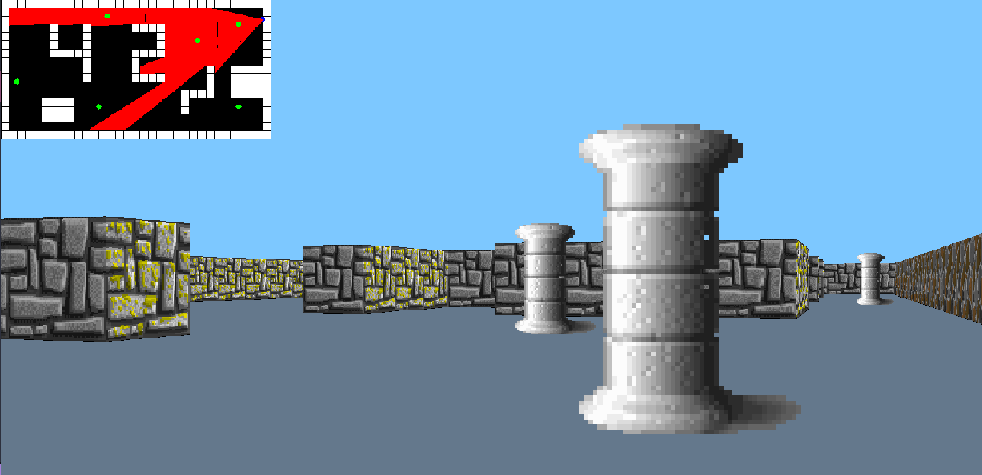

## 🚀 CUB3D
This project is inspired by the world-renowned eponymous game, considered the first FPS ever made. It will allow you to explore the technique of ray-casting.

Your goal will be to create a dynamic view inside a maze, in which will have to find the way out.

---

## 📖 Subject
There is a PDF in the subject folder containing details about the project.

---

## 🖥️ Running the project

Just a simple test just to see the function being performed.\
Note: The project was developed on MacOS, in other operating systems there may be undefined behaviors.

```bash
# Clone the repository
git clone https://github.com/r-moreira/42-projects.git

# Enter the project directory
cd cub3D/

# Run
make
```

---

## 👨‍💻 Commands

| KEY           | Action        |
| ------------- |:-------------:|
| `ESC`         | exit game     |
| `A`           | move left     |
| `D`           | move right    |
| `W`           | move forward  |
| `S`           | move backward |
| `→`           | turn right    |
| `←`           | turn left     |
| `M`           | hide/display map|

---

## 🖥 Preview
<p>
  
</p>
