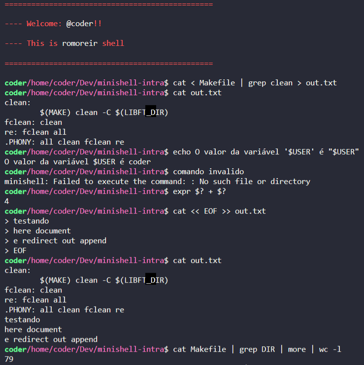

## 🚀 Minishell
TO-DO
---

## 📖 Subject
There is a PDF in the subject folder containing details about the project.

---

## 🖥️ Running the project
foo bar

```bash
# Install readline library
sudo-apt-get install libreadline6-dev

# Clone the repository
git clone https://github.com/r-moreira/42-projects.git

# Enter the project directory
cd minishell/

# Run
make
```

---

## ✔️ Features
TO-DO

---

## 🖥 Preview
<p>
  
</p>

