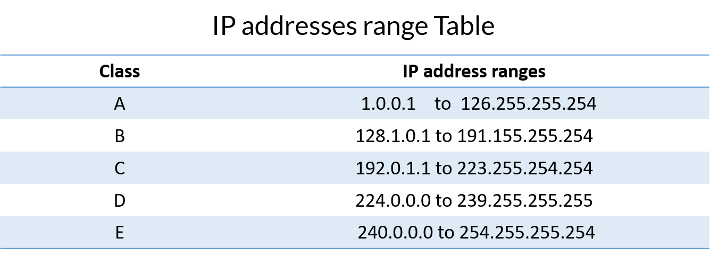
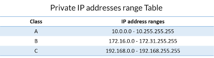
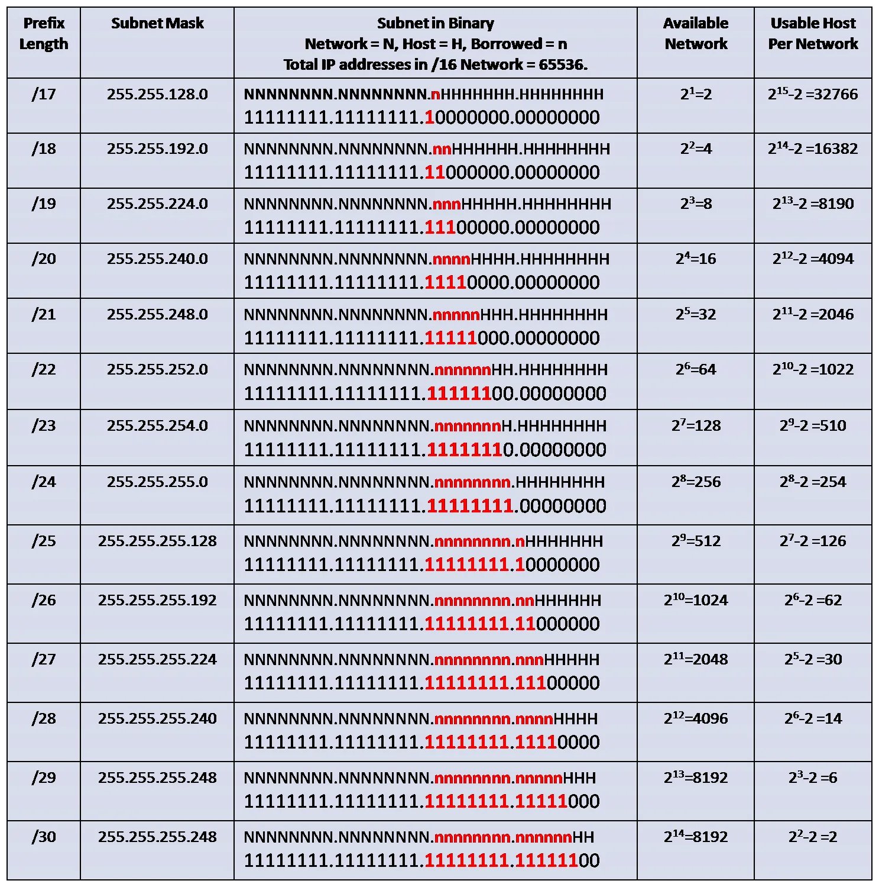
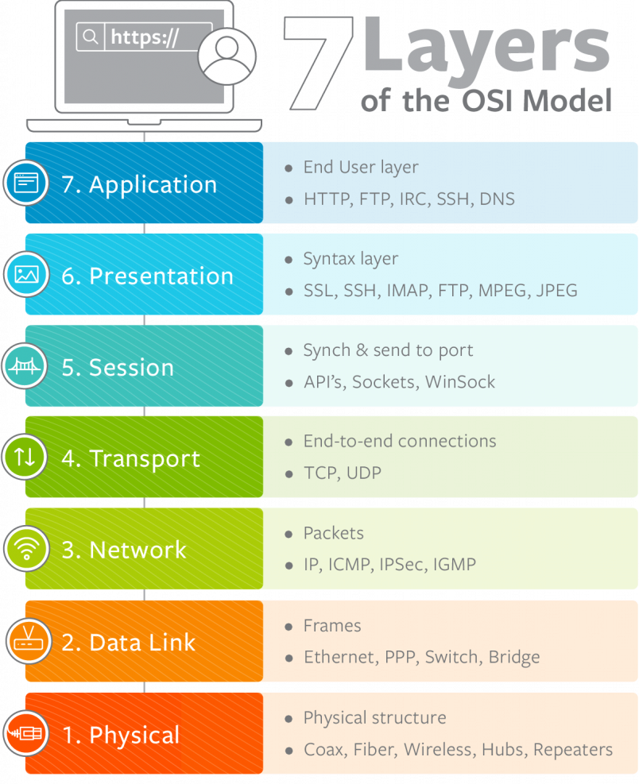

# My netwhat study notes

## Netwhat topics
 - What is an IP address - OK
 - What is a Netmask - OK
 - What is the subnet of an IP with Netmask - OK
 - What is the broadcast address of a subnet - OK
 - What are the different ways to represent an ip address with the Netmask - OK
 - What are the differences between public and private IPs - OK
 - What is a class of IP addresses - OK
 - What is TCP - OK
 - What is UDP - OK
 - What are the network layers - OK
 - What is the OSI model - OK
 - What is a DHCP server and the DHCP protocol - OK
 - What is a DNS server and the DNS protocol - OK
 - What are the rules to make 2 devices communicate using IP addresses
 - How does routing work with IP
 - What is a default gateway for routing
 - What is a port from an IP point of view and what is it used for when connecting to another device

---

## Resume of my research

---

### IP
 - IP address stands for internet protocol address; it is an identifying number that is associated with a specific computer or computer network. When connected to the internet, the IP address allows the computers to send and receive information.
 - 192.196.0.0 -> IP example
 - It's four **octets** separeted by **dots**

 - Each number is an 8-bit value (which is range from 0 to 255)
 - IP Addresses are **two adresses in one**:
 	1. Host Address
	2. Network Address

 - Since 1981, the IP space is broken in to **five classes**
	1. A (Large networks - First octet minus one fixed bit is the network, and the three remaining is the host)
	2. B (Medium networks - First two octets minus two fixed bits is the network, and the two remaining is the host)
	3. C (Small networks - First three octets minus three fixed bits is the network, and the remaining octet is the host)
	4. D (Multicast)
	5. E (Reserved)

- The first IP is used to network
- The last IP is used to **broadcast**
- Example (172.16.200.0/30)
	1. Network: 172.16.200.0 (not usable IP)
	2. First usable IP: 172.16.200.1
	3. Last usable IP: 172.16.200.2
	4. Broadcast: 172.16.200.3

- Different from public IP, **Private IP's are not allowed in the internet**

---

### Subnet mask

- The sub netmask tell us which part of the ip is from network, and which part is from host.
- Examples in dotted decimal:
	1. 225.0.0.0
	2. 225.225.0.0
	3. 225.225.225.0

- There are currently **three ways of showing the subnet masks** for IPv4 addresses; you can show them in **dotted decimal, binary, or classless interdomain routing (CIDR).**

- CIDR is based on variable-length subnet masking (VLSM). This allows it to define prefixes of arbitrary lengths making it much more efficient than the old system. CIDR IP addresses are composed of two sets of numbers. The network address is written as a prefix, like you would see a normal IP address (e.g. 192.255.255.255). The second part is the suffix which indicates how many bits are in the entire address (e.g. /12). Putting it together, a CIDR IP address would look like the following: 192.255.255.255/12

### TCP
- Keeps track of lost packages, makes sure that lost packages are re-sent
- Addes sequesce numbers to packets and reorders any packets that arrive in thenworng order.
- Slower, because of all added additional functionality.
- Requieres more computer resources, because the OS needs to keep track of ongoing communication sessions and manage them on a much deeper level.

---

### UDP
- Doesn't keep track of lost packages
- Doesn't care about package arrival order.
- Faster, bacause it lacks any extra features.
- Requieres less computer resources.
- Examples of programs and services that use UDP:
  1. DNS
  2. IP telephony
  3. DHCP
  4. Many computer games

---

### OSI Model and Network Layers
- The OSI Model (Open Systems Interconnection Model) is a conceptual framework used to describe the functions of a networking system. The OSI model characterizes computing functions into a universal set of rules and requirements in order to support interoperability between different products and software. In the OSI reference model, the communications between a computing system are split into seven different abstraction layers: Physical, Data Link, Network, Transport, Session, Presentation, and Application.

#### Physical Layer
- The lowest layer of the OSI Model is concerned with electrically or optically transmitting raw unstructured data bits across the network from the physical layer of the sending device to the physical layer of the receiving device. It can include specifications such as voltages, pin layout, cabling, and radio frequencies. At the physical layer, one might find “physical” resources such as network hubs, cabling, repeaters, network adapters or modems.

#### Data Link Layer
- At the data link layer, directly connected nodes are used to perform node-to-node data transfer where data is packaged into frames. The data link layer also corrects errors that may have occurred at the physical layer.
- The data link layer encompasses two sub-layers of its own. The first, media access control (MAC), provides flow control and multiplexing for device transmissions over a network. The second, the logical link control (LLC), provides flow and error control over the physical medium as well as identifies line protocols.

#### Network Layer
- The network layer is responsible for receiving frames from the data link layer, and delivering them to their intended destinations among based on the addresses contained inside the frame. The network layer finds the destination by using logical addresses, such as IP (internet protocol). At this layer, routers are a crucial component used to quite literally route information where it needs to go between networks.

#### Transport Layer
- The transport layer manages the delivery and error checking of data packets. It regulates the size, sequencing, and ultimately the transfer of data between systems and hosts. One of the most common examples of the transport layer is TCP or the Transmission Control Protocol.

#### Session Layer
- The session layer controls the conversations between different computers. A session or connection between machines is set up, managed, and termined at layer 5. Session layer services also include authentication and reconnections.

#### Presentation Layer
- The presentation layer formats or translates data for the application layer based on the syntax or semantics that the application accepts. Because of this, it at times also called the syntax layer. This layer can also handle the encryption and decryption required by the application layer.

#### Application Layer
- At this layer, both the end user and the application layer interact directly with the software application. This layer sees network services provided to end-user applications such as a web browser or Office 365. The application layer identifies communication partners, resource availability, and synchronizes communication.

---

### DHCP Server and DHCP Protocol
- DHCP server: DHCP (Dynamic Host Confivguration Protocol), is a protocol that provides quick, automatic, and central management for the distribution of IP addresses within a network. DHCP is also used to configure the subnet mask, default gateway and DNS server information on the device.

---

### DNS Server and DNS Protocol
- Domain Name System (DNS) is the phonebook of internet. Web browsers interact through Internet Protocol (IP) addresses. DNS translates domain names to IP addresses so browsers can load internet resources.

- The Domain Network System (DNS) protocol helps internet users and network devises discover websites using human-readable hostnames, instead of numeric IP addresses.

---

### What are the rules to make 2 devices communicate using IP addresses
- When a ‘message’ such as a file, image or video is transmitted across a network, it is first broken down into small blocks called segments. These are placed into containers called packets, typically by the Internet Protocol (IP). There are two versions of IP: version 4 and version 6.
- IP is responsible for delivering the packets from source to destination, and regardless of the version being used, packets must use some form of addressing to uniquely identify the message source and message destination
- The information added to the data to create the packet is called the IP header. The process of adding the IP header to the data is called ‘encapsulation’.

---

### How does routing work with IP
- IP Routing describes the process of determining the path for data to follow in order to navigate from one computer or server to another. A packet of data traverses from its source router through a web of routers across many networks until it finally reaches its destination router using a routing algorithm. The routing algorithm takes into account factors such as the size of a packet and its header to determine the most efficient route to the destination. When a packet has reached a router, the source and destination address of the packet are used in conjunction with a routing table (list that contains the routes to a certain network) to determine the next hop address. This process is repeated for the next router using its own routing table until the packet has reached its destination. Because the data is divided into packets, each packet travels independently from each other and is treated as such. As a result, each packet can be sent through a different route to the destination if necessary.

---

### What is a default gateway for routing
- When a host wants to reach a destination that is outside of its own network, it has to use a default gateway. We use a router or multilayer switch (that’s a switch that can do routing) as a default gateway.
- A default gateway is an intermediate device between the local network and the internet. The default gateway transfers internal data to the internet and back again

---

### What is a port from an IP point of view and what is it used for when connecting to another device
- A port is a virtual point where network connections start and end. Ports are software-based and managed by a computer's operating system. Each port is associated with a specific process or service. Ports allow computers to easily differentiate between different kinds of traffic.
- A port number is always associated with an IP address of a host and the type of transport protocol used for communication. It completes the destination or origination network address of a message.
