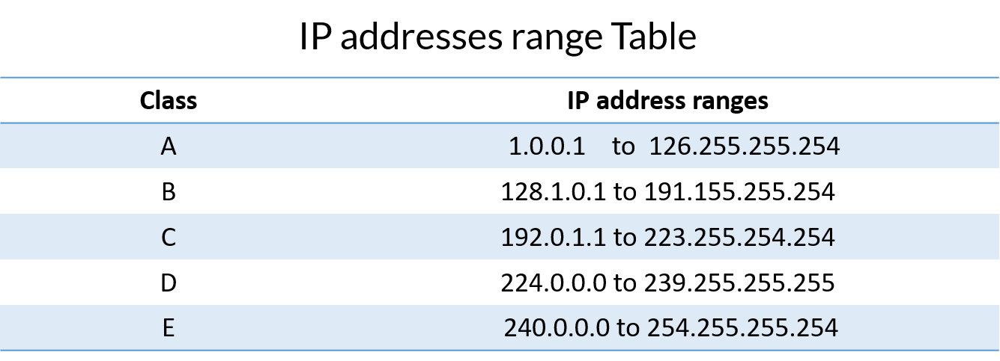

### Links
https://www.youtube.com/watch?v=QKfk7YFILws -> studying
### The network layer (47:00)

https://www.youtube.com/watch?v=qiQR5rTSshw
https://www.youtube.com/watch?v=0PbTi_Prpgs&list=PLmAuaUS7wSOP5wYwirQbMv5vKdPpJ_O_I

# My netwhat study notes

## Netwhat topics
 - What is an IP address
 - What is a Netmask
 - What is the subnet of an IP with Netmask
 - What is the broadcast address of a subnet
 - What are the different ways to represent an ip address with the Netmask
 - What are the differences between public and private IPs
 - What is a class of IP addresses
 - What is TCP◦What is UDP◦What are the network layers
 - What is the OSI model◦What is a DHCP server and the DHCP protocol
 - What is a DNS server and the DNS protocol◦What are the rules to make 2 devices communicate using IP addresses
 - How does routing work with IP◦What is a default gateway for routing
 - What is a port from an IP point of view and what is it used for when connectingto another device

---

## Resume of my research

 - IP address stands for internet protocol address; it is an identifying number that is associated with a specific computer or computer network. When connected to the internet, the IP address allows the computers to send and receive information.
 - 192.196.0.0 -> IP example
 - It's four **octets** separeted by **dots**

 - Each number is an 8-bit value (which is range from 0 to 255)
 - IP Addresses are **two adresses in one**:
 	1. Host Address
	2. Network Address

 - Since 1981, the IP space is broken in to **five classes**
	1. A (Large networks - First octet minus one fixed bit is the network, and the three remaining is the host)
	2. B (Medium networks - First two octets minus two fixed bits is the network, and the two remaining is the host)
	3. C (Small networks - First three octets minus three fixed bits is the network, and the remaining octet is the host)
	4. D (Multicast)
	5. E (Reserved)

- The first IP is used to network
- The last IP is used to broadcast
- Example (172.16.200.0/30)
	1. Network: 172.16.200.0 (not usable IP)
	2. First usable IP: 172.16.200.1
	3. Last usable IP: 172.16.200.2
	4. Broadcast: 172.16.200.3

- The subnetmask tell us which part of the ip is from network, and which part is from host.
- Examples:
	1. 225.0.0.0
	2. 225.225.0.0
	3. 225.225.225.0

- Private IP's are not allowed in the internet

